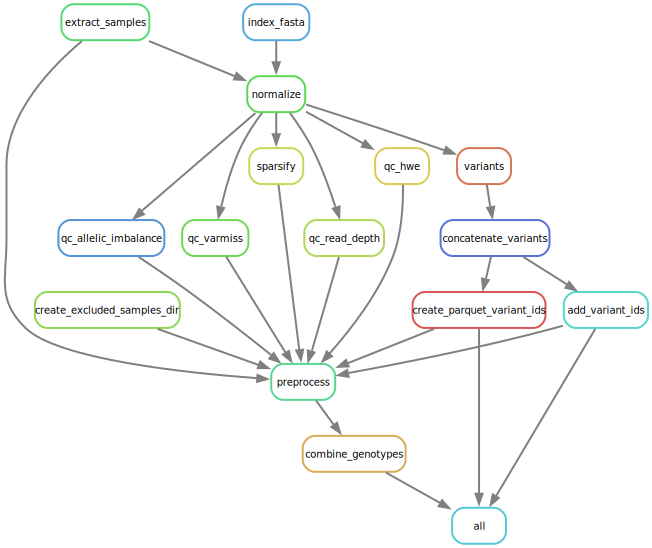

# DeepRVAT Preprocessing pipeline

The DeepRVAT preprocessing pipeline is based on [snakemake](https://snakemake.readthedocs.io/en/stable/) it uses
[bcftools+samstools](https://www.htslib.org/) and a [python script](preprocess.py) preprocessing.py.



## Output

The important files that this pipeline produces that are needed in DeepRVAT are:

- **preprocessed/genotypes.h5** *The main sparse hdf5 file*

- **norm/variants/variants.parquet** *List of variants i parquet format*

## Setup environment

Create the DeepRVAT processing environment

Clone this repository:
```shell
git clone git@github.com:PMBio/deeprvat.git
```
Change directory to the repository: `cd deeprvat`

```shell
mamba env create --file deeprvat_preprocessing_env.yml
```

Activate the environment

```shell
mamba activate deeprvat_preprocess
```

Install DeepRVAT in the environment

```shell
pip install -e .
```

## Configure preprocessing

The snakemake preprocessing is configured using a yaml file with the format below.
An example file is included in this repo: [example config](config/deeprvat_preprocess_config.yaml).

```yaml
# What chromosomes should be processed
included_chromosomes: [ 20,21,22 ]

# If you need to run a cmd to load bcf and samtools specify it here
bcftools_load_cmd: module load bcftools/1.10.2 &&
samtools_load_cmd: module load samtools/1.9 &&

# Path to where you want to write results and intermediate data
working_dir: /workdir
# Path to ukbb data
data_dir: /data

# These paths are all relative to the data dir
input_vcf_dir_name: vcf
metadata_dir_name: metadata

# expected to be found in the data_dir / metadata_dir
pvcf_blocks_file: pvcf_blocks.txt

# These paths are all relative to the working dir
# Here will the finished preprocessed files end up
preprocessed_dir_name: preprocesed
# Path to directory with fasta reference file
reference_dir_name: reference
# Here we will store normalized bcf files
norm_dir_name: norm
# Here we store "sparsified" bcf files
sparse_dir_name: sparse

# Expected to be found in working_dir/reference_dir
reference_fasta_file: GRCh38_full_analysis_set_plus_decoy_hla.fa

# The format of the name of the "raw" vcf files
vcf_filename_pattern: ukb23156_c{chr}_b{block}_v1.vcf.gz

# Number of threads to use in the preprocessing script, separate from snakemake threads
preprocess_threads: 16
   ```

The config above would use the following directory structure:

```shell
parent_directory
|-- data
|   |-- metadata
|   `-- vcf
`-- workdir
    |-- norm
    |   |-- bcf
    |   |-- sparse
    |   `-- variants
    |-- preprocesed
    |-- qc
    |   |-- allelic_imbalance
    |   |-- duplicate_vars
    |   |-- filtered_samples
    |   |-- hwe
    |   |-- indmiss
    |   |   |-- samples
    |   |   |-- sites
    |   |   `-- stats
    |   |-- read_depth
    |   `-- varmiss
    `-- reference

```

## Running the preprocess pipeline

After configuration and activating the environment run the pipeline using snakemake:

```shell
snakemake -j<nr_cores> --configfile config/deeprvat_preprocess_config.yaml -s preprocess.snakefile  
```
