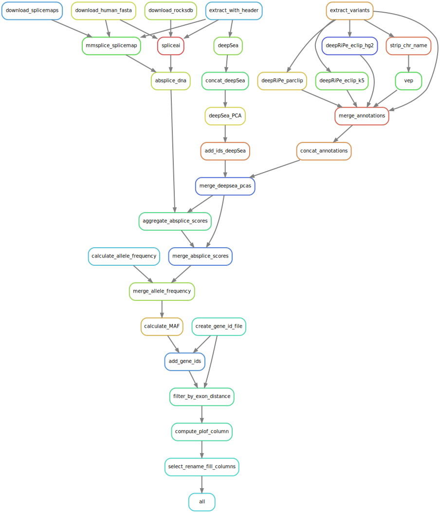

# DeepRVAT Annotation pipeline

This pipeline is based on [snakemake](https://snakemake.readthedocs.io/en/stable/). It uses [bcftools + samstools](https://www.htslib.org/), as well as [perl](https://www.perl.org/), [deepRiPe](https://ohlerlab.mdc-berlin.de/software/DeepRiPe_140/) and [deepSEA](http://deepsea.princeton.edu/) as well as [VEP](http://www.ensembl.org/info/docs/tools/vep/index.html), including plugins for [primateAI](https://github.com/Illumina/PrimateAI) and  [spliceAI](https://github.com/Illumina/SpliceAI). DeepRiPe annotations were acquired using [faatpipe repository by HealthML](https://github.com/HealthML/faatpipe)[[1]](#reference-1-target) and DeepSea annotations were calculated using [kipoi-veff2](https://github.com/kipoi/kipoi-veff2)[[2]](#reference-2-target), abSplice scores were computed using [abSplice](https://github.com/gagneurlab/absplice/)[[3]](#reference-3-target)



*Figure 1: Rule graph of the annotation pipeline.*

## Output 
This pipeline outputs a parquet file including all annotations as well as a file containing IDs to all protein coding genes needed to run DeepRVAT. 
Besides This the pipeline outputs a PCA transformation matrix for deepSEA as well as means and standard deviations used to standardize deepSEA scores before PCA analysis. This is helpful to recreate results using a different dataset. 
Furthermore, the pipeline outputs one annotation file for VEP, CADD, DeepRiPe, DeepSea and Absplice for each input vcf-file. The tool then creates concatenates the files, performs PCA on the deepSEA scores and merges the result into a single file. 

## Input

The pipeline uses left-normalized bcf files containing variant information, a reference fasta file as well as a text file that maps data blocks to chromosomes as input. It is expected that the bcf files contain the columns "CHROM" "POS" "ID" "REF" and "ALT". 
Any other columns, including genotype information are stripped from the data before annotation tools are used on the data. The variants may be split into several vcf files for each chromosome and each "block" of data. 
The filenames should then contain the corresponding chromosome and block number. The pattern of the file names, as well as file structure may be specified in the corresponding [config file](https://github.com/PMBio/deeprvat/blob/main/pipelines/config/deeprvat_annotation_config.yaml). The pipeline also requires input data and repositories descried in [requirements](#requirements).

(requirements)=
## Requirements

BCFtools as well as HTSlib should be installed on the machine, 
- [CADD](https://github.com/kircherlab/CADD-scripts/tree/master/src/scripts) as well as 
- [VEP](http://www.ensembl.org/info/docs/tools/vep/script/vep_download.html),  
- [kipoi-veff2](https://github.com/kipoi/kipoi-veff2)
- [faatpipe](https://github.com/HealthML/faatpipe), and the
- [vep-plugins repository](https://github.com/Ensembl/VEP_plugins/)

should be installed for running the pipeline, together with the [plugins](https://www.ensembl.org/info/docs/tools/vep/script/vep_plugins.html) for primateAI and spliceAI. Annotation data for CADD, spliceAI and primateAI should be downloaded. The path to the data may be specified in the corresponding [config file](https://github.com/PMBio/deeprvat/blob/main/pipelines/config/deeprvat_annotation_config.yaml). 
Download paths:
- [CADD](https://cadd.bihealth.org/download): "All possible SNVs of GRCh38/hg38" and "gnomad.genomes.r3.0.indel.tsv.gz" incl. their Tabix Indices
- [SpliceAI](https://basespace.illumina.com/s/otSPW8hnhaZR): "genome_scores_v1.3"/"spliceai_scores.raw.snv.hg38.vcf.gz" and "spliceai_scores.raw.indel.hg38.vcf.gz" 
- [PrimateAI](https://basespace.illumina.com/s/yYGFdGih1rXL) PrimateAI supplementary data/"PrimateAI_scores_v0.2_GRCh38_sorted.tsv.bgz"
- [AlphaMissense](https://storage.googleapis.com/dm_alphamissense/AlphaMissense_hg38.tsv.gz) 
Also a reference GTF file containing transcript annotations should be provided, this can be downloaded from [here](https://ftp.ebi.ac.uk/pub/databases/gencode/Gencode_human/release_44/gencode.v44.annotation.gtf.gz)


## Configure the annotation pipeline
The snakemake annotation pipeline is configured using a yaml file with the format akin to the [example file](https://github.com/PMBio/deeprvat/blob/main/pipelines/config/deeprvat_annotation_config.yaml).

The config above would use the following directory structure:
```shell
|--reference
|   |-- fasta file
|   |-- GTF file 

|-- preprocessing_workdir
|   |-- norm
|   |   |-- bcf
|   |   |   |-- bcf_input_files
|   |   |   |-- ...
|   |   |-- variants
|   |   |   |-- variants.tsv.gz
|   |-- preprocessed
|   |   |-- genotypes.h5


|-- output_dir
|   |-- annotations
|   |   |-- tmp
|   |   |   |-- deepSEA_PCA
|   |   |   |-- absplice

|-- repo_dir
|   |-- ensembl-vep
|   |   |-- cache
|   |   |-- plugins
|   |-- faatpipe
|   |-- kipoi-veff2

|-- annotation_data
|   |-- cadd
|   |-- spliceAI
|   |-- primateAI


```


Bcf files created by the [preprocessing pipeline](https://deeprvat.readthedocs.io/en/latest/preprocessing.html) are used as input data. The input data directory should only contain the files needed. 
The pipeline also uses the variant.tsv file, the reference file and the genotypes file from the preprocessing pipeline. 
A GTF file as described in [requirements](#requirements) and the FASTA file used for preprocessing is also necessary.
The pipeline begins by installing the repositories needed for the annotations, it will automatically install all repositories in the `repo_dir` folder that can be specified in the config file relative to the annotation working directory.
The text file mapping blocks to chromosomes is stored in `metadata` folder. The output is stored in the `output_dir/annotations` folder and any temporary files in the `tmp` subfolder. All repositories used including VEP with its corresponding cache as well as plugins are stored in `repo_dir/ensempl-vep`.
Data for VEP plugins and the CADD cache are stored in `annotation data`. 

## Running the annotation pipeline
### Preconfiguration
- Install the annotation environment
    ```shell
    mamba env create -f path/to/deeprvat/deeprvat_annotations.yml
    mamba activate deeprvat_annotations
    pip install -e path/to/deeprvat
    ```
- Clone the repositories mentioned in [requirements](#requirements) into `repo_dir` and install the needed conda environments with  
    ```shell
    mamba env create -f repo_dir/kipoi-veff2/environment.minimal.linux.yml
    mamba env create -f deeprvat/deeprvat_annotations.yml
    ```
  If you already have some of the needed repositories on your machine you can edit the paths in the [config](https://github.com/PMBio/deeprvat/blob/main/pipelines/config/deeprvat_annotation_config.yaml).
  

- Inside the annotation directory create a directory `annotation_dir` and download/link the prescored files for CADD, SpliceAI, and PrimateAI (see [requirements](#requirements))


### Running the pipeline
This pipeline should be run after running the [preprocessing pipeline](https://deeprvat.readthedocs.io/en/latest/preprocessing.html), since it relies on some of its output files (specifically the bcf files in  `norm/bcf/`, the variant files in `norm/variants/` and the genotype file `preprocessed/genotypes.h5`

After configuration and activating the `deeprvat_annotations` environment run the pipeline using snakemake:

```shell
  snakemake -j <nr_cores> -s annotations.snakemake --configfile config/deeprvat_annotation.config --use-conda
```


## References

(reference-1-target)=
<a id="1">[1]</a> Monti, R., Rautenstrauch, P., Ghanbari, M. et al. Identifying interpretable gene-biomarker associations with functionally informed kernel-based tests in 190,000 exomes. Nat Commun 13, 5332 (2022). https://doi.org/10.1038/s41467-022-32864-2

(reference-2-target)=
<a id="2">[2]</a> Žiga Avsec et al., “Kipoi: accelerating the community exchange and reuse of predictive models for genomics,” bioRxiv, p. 375345, Jan. 2018, doi: 10.1101/375345.

(reference-3-target)=
<a id="3">[3]</a>N. Wagner et al., “Aberrant splicing prediction across human tissues,” Nature Genetics, vol. 55, no. 5, pp. 861–870, May 2023, doi: 10.1038/s41588-023-01373-3.

