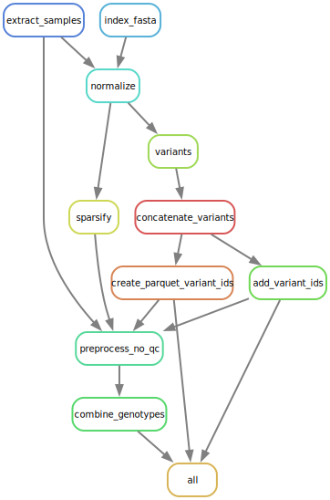
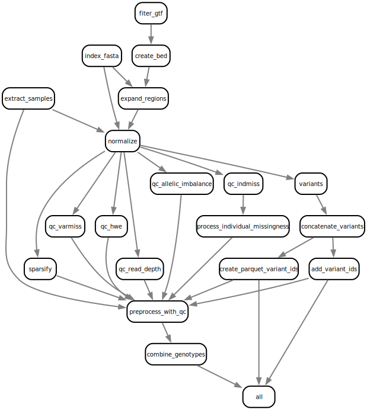

# DeepRVAT Preprocessing pipeline

The DeepRVAT preprocessing pipeline is based on [snakemake](https://snakemake.readthedocs.io/en/stable/) it uses
[bcftools+samstools](https://www.htslib.org/) and a [python script](https://github.com/PMBio/deeprvat/blob/main/deeprvat/preprocessing/preprocess.py) preprocessing.py.



## Output

The important files that this pipeline produces that are needed in DeepRVAT are:

- **preprocessed/genotypes.h5** *The main sparse hdf5 file*

- **norm/variants/variants.parquet** *List of variants in parquet format*

## Setup environment

Create the DeepRVAT processing environment

Clone this repository:

```shell
git clone git@github.com:PMBio/deeprvat.git
```

Change directory to the repository: `cd deeprvat`

```shell
mamba env create --file deeprvat_preprocessing_env.yml
```

Activate the environment

```shell
mamba activate deeprvat_preprocess
```

Install DeepRVAT in the environment

```shell
pip install -e .
```

## Configure preprocessing

The snakemake preprocessing is configured using a yaml file with the format below.
An example file is included in this repo: [example config](https://github.com/PMBio/deeprvat/blob/main/pipelines/config/deeprvat_preprocess_config.yaml).

```yaml
# What chromosomes should be processed
included_chromosomes : [21,22]

# The format of the name of the "raw" vcf files
vcf_files_list: vcf_files_list.txt

# If you need to run a cmd to load bcf and samtools specify it here, see example
bcftools_load_cmd : # module load bcftools/1.10.2 &&
samtools_load_cmd : # module load samtools/1.9 &&

# Path to where you want to write results and intermediate data
working_dir: workdir

# These paths are all relative to the working dir
# Here will the finished preprocessed files end up
preprocessed_dir_name : preprocesed
# Path to directory with fasta reference file
reference_dir_name : reference
# Here we will store normalized bcf files
norm_dir_name : norm
# Here we store "sparsified" bcf files
sparse_dir_name : sparse

# Expected to be found in working_dir/reference_dir
reference_fasta_file : GRCh38.primary_assembly.genome.fa

# You can specify a different zcat cmd for example gzcat here, default zcat
zcat_cmd:
   ```

The config above would use the following directory structure:

```shell
parent_directory
`-- workdir
    |-- norm
    |   |-- bcf
    |   |-- sparse
    |   `-- variants
    |-- preprocesed
    |-- qc
    |   |-- allelic_imbalance
    |   |-- duplicate_vars
    |   |-- filtered_samples
    |   |-- hwe
    |   |-- indmiss
    |   |   |-- samples
    |   |   |-- sites
    |   |   `-- stats
    |   |-- read_depth
    |   `-- varmiss
    `-- reference

```

### vcf_files_list
The `vcf_files_list` variable specifies the path to a text file that contains paths to the raw vcf files you want to 
process. 

ex:


```text
data/vcf/test_vcf_data_c21_b1.vcf.gz
data/vcf/test_vcf_data_c22_b1.vcf.gz
```

The easiest way to create `vcf_files_list` (if you have your files in `data/vcf` under the `parent_directory`)
```shell
cd <parent_directory>
find data/vcf -type f -name "*.vcf*" > vcf_files_list.txt
```
## Running the preprocess pipeline

There are two versions of the pipeline, one with qc (quality control) and one without, the version with qc is the one
we used when we wrote the paper. The qc is specific to the UKBB data, so if you want/need to do your own qc use the 
pipeline without qc.

### Run the preprocess pipeline with example data and qc


*The vcf files in the example data folder was generated using [fake-vcf](https://github.com/endast/fake-vcf) (with some
manual editing).
hence does not contain real data.*

1. cd into the preprocessing example dir

```shell
cd <path_to_repo>
cd example/preprocess
```

2. Download the fasta file

```shell
wget https://ftp.ebi.ac.uk/pub/databases/gencode/Gencode_human/release_44/GRCh38.primary_assembly.genome.fa.gz -P workdir/reference
```

3. Unpack the fasta file

```shell
gzip -d workdir/reference/GRCh38.primary_assembly.genome.fa.gz
```

4. Run with the example config

```shell
snakemake -j 1 --snakefile ../../pipelines/preprocess_with_qc.snakefile --configfile ../../pipelines/config/deeprvat_preprocess_config.yaml
```

5. Enjoy the preprocessed data 🎉

```shell
ls -l workdir/preprocesed
total 48
-rw-r--r--  1 user  staff  6404 Aug  2 14:06 genotypes.h5
-rw-r--r--  1 user  staff  6354 Aug  2 14:06 genotypes_chr21.h5
-rw-r--r--  1 user  staff  6354 Aug  2 14:06 genotypes_chr22.h5
```


### Run the preprocess pipeline with example data and no qc


*The vcf files in the example data folder was generated using [fake-vcf](https://github.com/endast/fake-vcf) (with some
manual editing).
hence does not contain real data.*

1. cd into the preprocessing example dir

```shell
cd <path_to_repo>
cd example/preprocess
```

2. Download the fasta file

```shell
wget https://ftp.ebi.ac.uk/pub/databases/gencode/Gencode_human/release_44/GRCh38.primary_assembly.genome.fa.gz -P workdir/reference
```

3. Unpack the fasta file

```shell
gzip -d workdir/reference/GRCh38.primary_assembly.genome.fa.gz
```

4. Run with the example config

```shell
snakemake -j 1 --snakefile ../../pipelines/preprocess_no_qc.snakefile --configfile ../../pipelines/config/deeprvat_preprocess_config.yaml
```

5. Enjoy the preprocessed data 🎉

```shell
ls -l workdir/preprocesed
total 48
-rw-r--r--  1 user  staff  6404 Aug  2 14:06 genotypes.h5
-rw-r--r--  1 user  staff  6354 Aug  2 14:06 genotypes_chr21.h5
-rw-r--r--  1 user  staff  6354 Aug  2 14:06 genotypes_chr22.h5
```

### Run on your own data with qc

After configuration and activating the environment run the pipeline using snakemake:

```shell
snakemake -j<nr_cores> --configfile config/deeprvat_preprocess_config.yaml -s preprocess_with_qc.snakefile  
```


### Run on your own data without qc

After configuration and activating the environment run the pipeline using snakemake:

```shell
snakemake -j<nr_cores> --configfile config/deeprvat_preprocess_config.yaml -s preprocess_no_qc.snakefile  
```
